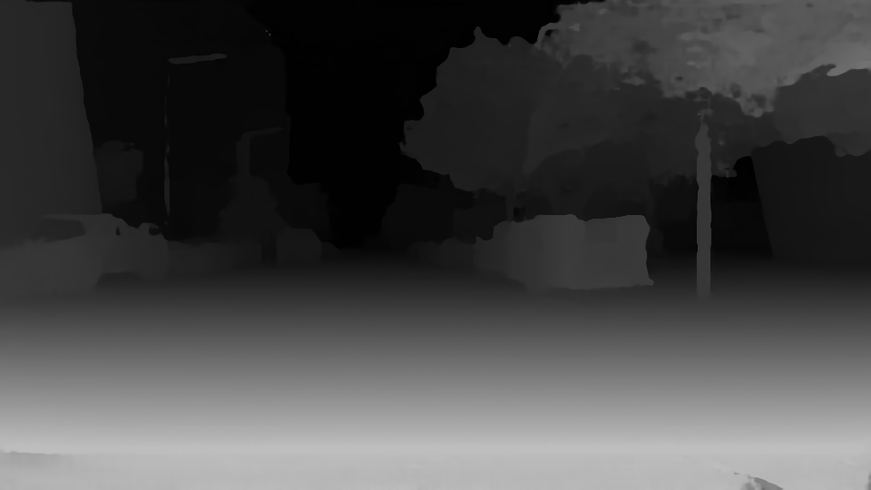

# Pyramid
Pyramid stereo network

This is our blogpost

Contents:
Intro
Describe model
-pretrained sceneflow model
-three datasets monkaa etc consisting of right,left and disparity image

-computing test loss, on  a single dataset giving epe.
-we found epe on pretrained models

-we compared images 
-then we finetuned the model

Results and how we did it
-epe
-disparity maps

Analysis
-we finetuned model, results and how

Conclusion

# Pyramid Stereo Matching Network

This is our blogpost and here we go
Here is the PSMNet repository made by the authors.

https://github.com/JiaRenChang/PSMNet

## Contents

1. [Introduction](#introduction)
2. [Model Description](#model)
3. [Results](#results)
4. [Analysis of model](#analysis)
5. [Conclusion](#conclusion)

## Introduction

DO INTRO
''Recent work has shown that depth estimation from a stereo pair of images can be formulated as a supervised learning task to be resolved with convolutional neural networks (CNNs). However, current architectures rely on patch-based Siamese networks, lacking the means to exploit context information for finding correspondence in illposed regions. To tackle this problem, we propose PSMNet, a pyramid stereo matching network consisting of two main modules: spatial pyramid pooling and 3D CNN. The spatial pyramid pooling module takes advantage of the capacity of global context information by aggregating context in different scales and locations to form a cost volume. The 3D CNN learns to regularize cost volume using stacked multiple hourglass networks in conjunction with intermediate supervision.''

## Model Description
Estimation of depth of the image is essential in many computer vision applications. The PSMNet network aims to do exactly that. The model is evaluated on different
datasets to show how accurate these features can be predicted.

The description of the network is shown in the figure below.
Left and right image are inputs which are compared, and predicted disparity image is created.

The network has a CNN layer, followed by Spatial Pyramid Pooling Module which is a unique contribution form the authors of the network. Then the cost volume is implemented, and finally a 3D CNN layer. 

The cost volume is made by concatenating left feature maps with the corresponding right feature maps across disparity levels. This results in a 4D volume (height x width
x disparity x feature size).[1]

Finally, the loss is calculated by comparing the predicted disparity to the ground truth disparity.

### Datasets used

The model uses SceneFlow dataset which concists of 3 subsets - 'Driving', 'Flying 3Dthings' and 'Monkaa'. The model which is pretrained on sceneflow dataset was used to measure the end-point-error. Afterwards the model was finetuned on KITTI dataset and results were compared.

We tried to reproduce the results of end-point-error by evaluating the pretrained model on sample 'Monkaa' dataset and 'Driving' dataset separately. Afterwards, ablation study was performed to see what are the consequences of finetuning the pretrained model. 

## Results

### Evaluation of the end-point-error

End-point-error is defined as the test loss between predicted disparity to the ground truth disparity. This numeric in the original paper was obtained as 1.09, however, larger values were found during the reproduction study. On 'Monkaa' sample subset the error was as large as 10.

The large error is also partially due to small dataset used. However, there was also an issue reported that finding an error close to 1.09 requires to toggle the corners and without training the model on SceneFlow from scratch, such small error could not be reproduced. A larger dataset on driving vehicles is showing an end-point-error of around 6, when tested on SceneFlow pretrained model.

So the loss was computed on the pretrained SceneFlow dataset. Likely, a finetuned model on KITTI dataset would give somewhat better results which is investigated later in analysis. The authors also mention a high accuracy on KITTI dataset. 

The exact computation of end-point-error was made by adapting the main.py file of the repository, and making sure that all the inputs were passed correctly. The code was adapted because, due to memory requirements, the end-point-error was estimated on a separate 'Monkaa'or 'Driving' dataset instead of sceneflow dataset which consists
of three subsets.

## Analysis

### 2: Finetune on KITTI 2015 dataset
As a second step in our reproducibility project, we decided to use the Sceneflow pretrained model and finetune it on KITTI 2015, hence comparing the disparity images and find qualitative differences in the images. For the finetune, Google Colab was chosen. Since the RAM memory was limited, the batch size was reduced from 12 to 4 and the number of epochs was set to 300 epochs. Unfortunately the runtime of the VM in Google Colab is limited (12 hours) hence we managed to finetune the model for maximum 186 epochs. Nevertheless, this was enough to get disparity images.
To compare the pretrained model and the finetuned model, we decided to test the models on two pairs of stereo images, one from Driving dataset and one from Monkaa dataset (both subsets of Sceneflow dataset). 

Below the predicted disparity of the pair of stereo images from Driving subset are shown. It's noticeable that the predicted disparity from the pretrained model is much smoother than the one from the finetuned model. The finetuned model shows bad results in the region of the photo very close to the camera (street floor). Nevertheless, the finetuned model shows to be able to better detect street the proximity of image features such as the cars and the lights. 

#### Left image (Driving)

#### Predicted disparity pretrained model (grayscale)

#### Predicted disparity finetuned model (grayscale)
 

Below the predicted disparity of the pair of stereo images from Monkaa subset are shown. The pretrained model is able to nicely identify the promiximity of the monkey, with some difficulties with the face. On the other hand, the finetuned model shows bad results, since it is not able to detect relevant features of the image. These could be adressed to the fact that the KITTI 2015 dataset only has real images of streets and not of cartoons, therefore the model actually performs worse in this case. 

#### Left image (Monkaa)

#### Predicted disparity pretrained model (grayscale)

#### Predicted disparity finetuned model (grayscale)
 

## Conclusion

An interesting project

## References
[1] Jia-Ren Chang and Yong-Sheng Chen. "Pyramid Stereo Matching Network", 2018.
