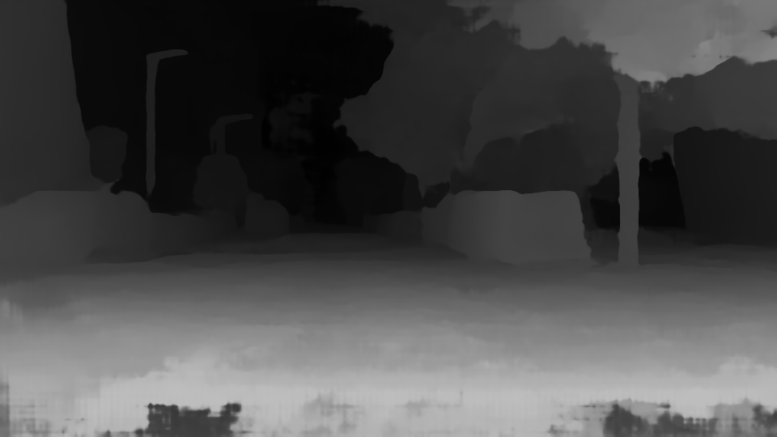

# Pyramid Stereo Matching Network

This is the blogpost of group 70 on reproduction project on Pyramid Stereo Matching network.

Authors of the blogpost:
Youssef Farah & Edgars Daugulis

Here is the PSMNet repository made by the authors of PSMNet network.

https://github.com/JiaRenChang/PSMNet

## Contents

1. [Introduction](#introduction)
2. [Model Description](#model)
3. [Results](#results)
4. [Analysis of model](#analysis)
5. [Conclusion](#conclusion)

## Introduction

Depth estimation in images is an important application in computer vision tasks. The following reproducibility project aims to reproduce a pyramid stereo matching network and analyse its performance. Depth estimation from a stereo pair of images can be formulated as a supervised learning task, which implements convolutional neural networks (CNN). The PSMNet network is created which consists of two main modules: spatial pyramid pooling and 3D CNN. The reproduction project aims to replicate the PSMNet results and evaluate its performance on different models and different datasets. The first task is to reproduce the End-Point-Error (EPE) of the model trained on Sceneflow dataset. Then the the model is finetued on another dataset (KITTI 2015) to see if more accurate results can be achieved.


## Model Description
Estimation of depth of the image is essential in many computer vision applications. The PSMNet network aims to do exactly that. The model is evaluated on different
datasets to show how accurate these features can be predicted.

The description of the network is shown in the figure below.
Left and right image are inputs which are compared, and predicted disparity image is created.


As shown in the schematic above, the network has a CNN layer through which both left and right images are passed through. These CNN layers share weight. This is then followed by Spatial Pyramid Pooling Module which is a unique contribution from the authors of the network. The structure of this module is displayed in the red box. The module uses adaptive average pooling to compress features into four scales which is then followed by 1×1 convolution in order to reduce feature dimension.

The cost volume is made by concatenating left feature maps with the corresponding right feature maps across disparity levels. This results in a 4D volume (height x width
x disparity x feature size).[1]

Then a 3D CNN module is applied whose structure is shown in the yellow box. Two kinds of 3D CNN architectures are proposed to regularize cost volume, these are called *basic* and *stacked hourglass*. The former just consists of 12 3×3×3 convolution layers of dimension, then the cost volume is upsampled back to
size H×W×D (height×width×maximum disparity) via bilinear interpolation, and finally regression is applied to calculate disparity map of size H×W.

The *stacked hourglass* architecture implements three main hourglass networks, disparity map is generated by each of them. Then *stacked hourglass* architecture actually has three outputs and losses, named Loss 1, Loss 2 and Loss 3. During training the weighted sum of the three losses are used (so, for example, this criterion is implemented in the pretrained models). During the testing phase, however, the last of the three outputs is used as the final disparity map. [1]

Finally, the loss is calculated by comparing the predicted disparity to the ground truth disparity, hence to the final disparity map outputted by *stacked hourglass* module. This test loss is called *end-point-error*.

### Datasets used

The model uses SceneFlow dataset which concists of 3 subsets - 'Driving', 'Flying 3Dthings' and 'Monkaa'. The model which is pretrained on SceneFlow dataset was used to measure the end-point-error. Afterwards the model was finetuned on KITTI dataset and results were compared.

We tried to reproduce the results of end-point-error by evaluating the pretrained model on sample 'Monkaa' dataset and 'Driving' dataset separately. Afterwards, ablation study was performed to see what are the consequences of finetuning the pretrained model. 


## Results


### Evaluation of the end-point-error

End-point-error is defined as the test loss between predicted disparity to the ground truth disparity. This number in the original paper was obtained as 1.09, however, larger values were found during the reproduction study. On 'Monkaa' sample subset the error was as large as 10.

The total test loss is evaluated as shown below. The function 'test' takes left image, right image and disparity map to evaluate the loss.
```
	total_test_loss = 0
	for batch_idx, (imgL, imgR, disp_L) in enumerate(TestImgLoader):
	       test_loss = test(imgL,imgR, disp_L)
	       print('Iter %d test loss = %.3f' %(batch_idx, test_loss))
	       total_test_loss += test_loss

	print('total test loss = %.3f' %(total_test_loss/len(TestImgLoader)))
```

The large error is also partially due to small dataset used. However, there was also an issue reported that finding an error close to 1.09 requires to toggle the corners and without training the model on SceneFlow from scratch, such small error could not be reproduced. A larger dataset on driving vehicles is showing an end-point-error of around 6, when tested on SceneFlow pretrained model.

So the loss was computed on the pretrained SceneFlow dataset. Likely, a finetuned model on KITTI dataset would give somewhat better results which is investigated later in analysis. The authors also mention a high accuracy on KITTI dataset. 

The exact computation of end-point-error was made by adapting the main.py file of the repository, and making sure that all the inputs were passed correctly. The part of the code calculating the end-point-error is shown above. The code was adapted because, due to memory requirements, the end-point-error was estimated on a separate 'Monkaa'or 'Driving' dataset instead of sceneflow dataset which consists
of three subsets.


## Analysis

### Finetuning on KITTI 2015 dataset
As a second step in our reproducibility project, we decided to use the Sceneflow pretrained model and finetune it on KITTI 2015, hence comparing the disparity images and find qualitative differences in the images. For the finetune, Google Colab was chosen. Since the RAM memory was limited, the batch size was reduced from 12 to 4 and the number of epochs was set to 300 epochs. Unfortunately the runtime of the VM in Google Colab is limited (12 hours) hence we managed to finetune the model for maximum 186 epochs. Nevertheless, this was enough to get disparity images.
To compare the pretrained model and the finetuned model, we decided to test the models on two pairs of stereo images, one from Driving dataset and one from Monkaa dataset (both subsets of Sceneflow dataset). 

Below the predicted disparity of the pair of stereo images from Driving subset are shown. It's noticeable that the predicted disparity from the pretrained model is much smoother than the one from the finetuned model. The finetuned model shows bad results in the region of the photo very close to the camera (street floor). Nevertheless, the finetuned model shows to be able to better detect street the proximity of image features such as the cars and the lights. 

#### Left image (Driving)


#### Predicted disparity pretrained model (grayscale)


#### Predicted disparity finetuned model (grayscale)
 

Below the predicted disparity of the pair of stereo images from Monkaa subset are shown. The pretrained model is able to nicely identify the promiximity of the monkey, with some difficulties with the face. On the other hand, the finetuned model shows bad results, since it is not able to detect relevant features of the image. These could be adressed to the fact that the KITTI 2015 dataset only has real images of streets and not of cartoons, therefore the model actually performs worse in this case. 

#### Left image (Monkaa)


#### Predicted disparity pretrained model (grayscale)


#### Predicted disparity finetuned model (grayscale)
 


## Conclusion

The aim of this reproducibility project was to reproduce the EPE for a PSMNet trained on SceneFlow dataset, and see what are the outcomes of finetuning this model on KITTI 2015 dataset.
For the EPE, it is found out that the pretrained model provided by the authors is damaged, as inference has shown a high EPE. Eventually training the model from scratch would lead to an EPE close to the one mentioned by the authors. This for us was not possible due to the large size of the dataset.
Regarding the finetune, the model has shown better results for street images, whereas for cartoon images it works bad, and this was predictable since the KITTI 2015 has only real-life street images.


## References
[1] Jia-Ren Chang and Yong-Sheng Chen. "Pyramid Stereo Matching Network", 2018.
